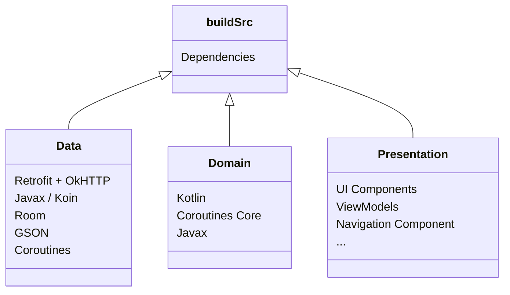
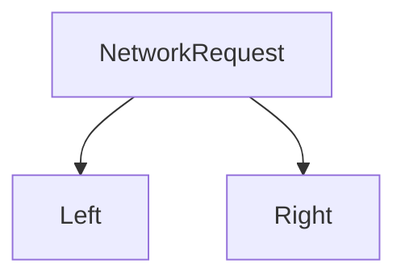

# Introduction 🔰
Всех приветствую! Поздравляю вас, что вы хорошо сдали ТЗ и прошли техническое интервью 
Теперь вы являетесь почти полноценными членами команды Android в GeekStudio. 
Однако, то что вы прошли до этого, еще не конец всех испытаний, которые вас ждут впереди.
Я и Альберт будем испытывать вас по максимуму, подготавливая вас к новым, неизведанным горизонтам Android Development'a.

За каждым из вас будет закреплен ментор (Тимур или Альберт), который будет следить за вашим прогрессом,
ревьювить код, обсуждать проблемы и помогать.

Это будет ваше первое тестовое задание, по выполнении которого вы ознакомитесь со всем тем,
что вам понадобится при работе.

После того как вы приступили к тестовому заданию, пишите вашему куратору время начала выполнения таска. 
Все проблемы и вопросы пишите ему.
	
## Technical Task #1 📝
Все тестовые задания будут выполняться в одном проекте, использующий Kitsu API как бэкэнд.
По ходу выполнения тестовых заданий, приложение будет наполняться новым функционалом.
По окончанию всех тестовых заданий, вы будете готовы покорять новые горизонты.

 Необходимо создать приложение, реализовав следующее : 
 
     - Экран с Tab Layout, состоящий из 3 табов : 
                     - RecyclerView с Аниме
                     - RecyclerView с Мангой
                     - RecyclerView с Пользователями                                                                                                                                                      
     - Дизайн брать с Kitsu приложения()

	
- [API documentation](https://kitsu.docs.apiary.io/#)
- [Kitsu App](https://play.google.com/store/apps/details?id=com.everfox.animetrackerandroid) (откуда надо брать дизайн)
- [Проект-пример для подключения buildSrc + Kotlin DSL](https://github.com/Clar1fy/CryptocurrencyApp)

	
## Требования по используемым технологиям 👨🏻‍💻
 - Kotlin + Kotlin code style 
 - Single Activity + Clean Architecture + MVVM
 - Koin 
 - Modularization
 - Retrofit + OkHTTP
 - Paging 3 
 - Kotlin DSL (BuildSrc)
 - Powerful .gitignore
 - Kotlin coroutines + Flow
 - ViewPager2
 - Navigation Component
 - Material Design ( Material Components only )


## Powerful .gitignore 🦾 
```:.gitignore
### Android template
# Built application files
*.apk
*.aar
*.ap_
*.aab

# Files for the ART/Dalvik VM
*.dex

# Java class files
*.class

# Generated files
bin/
gen/
out/
#  Uncomment the following line in case you need and you don't have the release build type files in your app
# release/

# Gradle files
.gradle/
build/

# Local configuration file (sdk path, etc)
local.properties

# Proguard folder generated by Eclipse
proguard/

# Log Files
*.log

# Android Studio Navigation editor temp files
.navigation/

# Android Studio captures folder
captures/

# IntelliJ
/.idea
*.iml
.idea/workspace.xml
.idea/tasks.xml
.idea/gradle.xml
.idea/assetWizardSettings.xml
.idea/dictionaries
.idea/libraries
# Android Studio 3 in .gitignore file.
.idea/caches
.idea/modules.xml
# Comment next line if keeping position of elements in Navigation Editor is relevant for you
.idea/navEditor.xml

# Keystore files
# Uncomment the following lines if you do not want to check your keystore files in.
#*.jks
#*.keystore

# External native build folder generated in Android Studio 2.2 and later
.externalNativeBuild
.cxx/

# Google Services (e.g. APIs or Firebase)
# google-services.json

# Freeline
freeline.py
freeline/
freeline_project_description.json

# fastlane
fastlane/report.xml
fastlane/Preview.html
fastlane/screenshots
fastlane/test_output
fastlane/readme.md

# Version control
vcs.xml

# lint
lint/intermediates/
lint/generated/
lint/outputs/
lint/tmp/
# lint/reports/

# Android Profiling
*.hprof

#MacOSX
**/.DS_Store
```

## Outroduction 
После выполнения таска, заливаете на GitHub и отправляете вашему прикрепленному куратору

## Technical Task #2 - Advanced Filtering & Sorting 📝
Как вам Kitsu ? Нравится ? Да, сложно и долго, муторно. Но оно того стоит, так как в будущем все с чем вы сталкиваетесь сейчас поможет вам.
	
В этом техническом задании мы ознакомимся с продвинутой фильтрацией и сортировкой.
Для начала, посмотрите на фильрацию и ее возможности на официальной докеументации. 
` https://kitsu.docs.apiary.io/#introduction/json-api/filtering-and-search`
Для реализации фильтрации нам понадобится использовать `@Query` параметр.
   **Пример запроса с фильтрацией аниме по категориям**
```kotlin:AnimeApiService.kt
@GET("anime")
    suspend fun fetchAnime(
        @Query("page[limit]") pageLimit: Int,
        @Query("page[offset]") pageOffset: Int,
        @Query("filter[categories]") category: String
    ): AnimeListDto
```
Чтобы выполнить таск, вам надо будет добавить фильтр-кнопку в Toolbar, которая будет видна только для Аниме и Манги.
При нажатии на фильтр-кнопку, откроется диалог, в котором будут стягиваться категории по `endpoint`  
`https://kitsu.io/api/edge/categories`
	
1. По нажатию на категорию, будет происходить фильтрация по выбранной категории на Аниме или Мангу, диалог будет закрываться.
2. Также будет присутствовать кнопка сбросить категорию, по нажатию которой будут стягиваться все Аниме и Манги без категории
## Technical Task #3 📝
Поздравляю вас с прохождением второго этапа тестового задания. Как вам маппинг ? Долго ? Ничего, самое долгое и муторное позади. 
	
В выполнении данного технического задания, вы ознакомитесь с процессом входа в приложения используя ``OAuth 2.0``, как основной инструмент для входа.
	
При отправке запроса на endpoint `https://kitsu.io/api/oauth/token` со следующим `@Body`
```json
{
  "grant_type": "password", 
  "username": "timplifier@gmail.com" // Юзернейм для входа,
  "password": "2281337abd" // Пароль для входа
}
```
мы получим наш так называемый `AuthenticationDto`, хранящий в себе следующее : 
```json
{
    "access_token": "EgLdmpYr5TRe0J3F84", // Access Token
    "token_type": "Bearer", // Тип Access Token'a
    "expires_in": 2586900, // Время жизни (30 дней по дефолту)
    "refresh_token": "IvtY_EWUpzlF6OSZtT5Vja" // Refresh Token,
    "scope": "public",
    "created_at": 1678093440
}
```
При успешном входе, вам нужно будет авторизовать User'a и перенести его на главный экран. При повторном входе в приложение, юзер должен быть перенесен на главный экран, так как он вошел в аккаунт. Это необходимо реализовать с помощью **Flow Fragment**, который вы изучите, прочитав статьи выше.

## Статьи, которые рекомендуется прочитать для детального ознакомления  📄
- https://habr.com/ru/post/654599/
- https://habr.com/ru/post/667026/
- https://habr.com/ru/post/673180/
	
## Technical Task #4 - Deep @POST request diving 📝
Маппинг, фильтрация и аутентификация позади. Осталось интересное, но не мене сложное - `@POST` запросы. Сам по себе `@POST` запрос может быть утилизирован используя `@Body` параметр, позволяющий закинуть Raw Body, состояющий исключительно из `JSON`. 
В данном таске вы должны будете создать возможность юзеры постить посты, как в Twitter, Instagram и т.п.
Мы хотим от вас следующий дизайн : 
 1. В TabLayout добавится 4 таб - Posts, в котором будут стягиваться все посты по endpoint `https://kitsu.io/api/edge/posts`. Дизайн : 

 2. Если пост содержит `spoiler` (в модельке `spoiler = true`), то закрывать контент поста заглушкой.  
 По нажатию на заглушку, показывается контент поста.
 3. Bottom Navigation c кнопкной "+" по середине 
 
 4. По нажатию на "+" перекидывает на следующий экран : 
 5. По нажатию на кнопку "Post" в Toolbar, будет происходить `@POST` запрос на создание поста, Также можно выбрать, что пост содержит `NSFW` контент или он содержит `Spoiler`. Как пост был создан, навигировать назад. 

 Чтобы отправить запрос на создание поста, нужно отправить следующее в `@Body` на `https://kitsu.io/api/edge/posts`
```json
{
    "data": {
        "attributes": {
            "content": "sdfsdf", // Контент поста
            "nsfw": false, // Содержит ли NSFW контент
            "spoiler": false // Является ли пост спойлером
        },
        "relationships": {
            "user": {
                "data": {
                    "type": "users",
                    "id": "1307864" // id пользователя
                }
            },
            "uploads": {
                "data": []
            }
        },
        "type": "posts"
    }
}
```
Пример запроса на создание поста : 
```kotlin:UserApiService.kt
    @POST("posts")
    suspend fun createPost(@Body createPostDto: CreatePostDto)
```
## Technical Task #5 - No more BuildSrc 📝
**Сильно**, если дошел до этого этапа, наверное забыл уже про **`buildSrc`**, да ? **`buildSrc`** 
это всего один из способов грамотного **`Dependency Management`** для многомодульных проектов. 
В этом техническом задании вы узнаете про еще один, чуть сложнее, но самый удобный  - `Version Catalog`.
Посмотрев на **диаграмму** ниже, вы можете понять, насколько важен `Dependency Management` для управления зависимостями.

На данный момент, ваш **`app build.gradle.kts`** выглядит примерно вот так: 
```groovy:app build.gradle.kts
Dependencies {

    // UI Components
    implementation(Dependencies.UIComponents.appCompat)
    implementation(Dependencies.UIComponents.material)
    implementation(Dependencies.UIComponents.constraintLayout)
    implementation(Dependencies.UIComponents.viewBindingPropertyDelegate)

    // Core
    implementation(Dependencies.Core.core)

    // Activity
    implementation(Dependencies.Activity.activity)

    // Fragment
    implementation(Dependencies.Fragment.fragment)

    // Lifecycle
    implementation(Dependencies.Lifecycle.runtime)
    implementation(Dependencies.Lifecycle.viewModel)
    implementation(Dependencies.Lifecycle.liveData)

    // Navigation
    implementation(Dependencies.Navigation.fragment)
    implementation(Dependencies.Navigation.ui)
    
    // Glide
    implementation(Dependencies.Glide.glide)

    // Retrofit
    implementation(Dependencies.Retrofit.retrofit)
    implementation(Dependencies.Retrofit.converterGson)

    // OkHttpClient
    implementation(Dependencies.OkHttp.loggingInterceptor)
    implementation(Dependencies.OkHttp.okHttp)
    implementation(Dependencies.OkHttp.bom)

    // Koin
    implementation(Dependencies.Koin.koinAndroid)


    // Glide
    implementation(Dependencies.Glide.glide)


    // SplashScreen
    implementation(Dependencies.SplashScreen.splashScreen)

    // Room with coroutines
    implementation(Dependencies.Room.runtime)
    implementation(Dependencies.Room.supportKotlinExtensionsAndCoroutines)
    kapt(Dependencies.Room.compiler)
```

Ну уж слишком много `implementation`, занимающие много места, мазолящие глаза.
А теперь представьте, что будет если ваш блок `dependencies` выглядит примерно так:

```groovy:app build.gradle.kts
dependencies {
    implementation(core)
    implementation(domain)
    implementation(feature_chat)
    implementation(coreUi)
    implementation(feature_auth)
    implementation(featurePostAnAd)

    implementation(deps.circleImageView)

    implementation(deps.jetpackNavigation.uiNavigation)
    implementation(deps.jetpackNavigation.fragmentNavigation)

    implementation(deps.koin.android)
    implementation(deps.koin.navigation)
    implementation(deps.timber)
    implementation(deps.arrow.core)

    implementation(deps.squareup.gsonConverter)

    implementation(deps.uCrop)
    implementation(deps.imagePicker)
    implementation(deps.glide)

    implementation(deps.paging3.androidPaging)

    implementation(deps.shimmer)

    implementation(deps.view.maskedEdt)
    implementation(deps.flexBoxLayout)

    implementation(deps.kotlin)
    implementation(deps.androidx.material)
    implementation(deps.androidx.appCompat)
    implementation(deps.androidx.constraintLayout)
    implementation(deps.androidx.coreKtx)
    implementation(deps.androidx.recyclerView)
    implementation(deps.androidx.swipeRefreshLayout)
    implementation(deps.lifecycle.commonJava8)
    implementation(deps.lifecycle.runtimeKtx)
    implementation(deps.lifecycle.viewModelKtx)
    implementation("com.markodevcic:peko:2.1.4")

    implementation("androidx.legacy:legacy-support-v4:1.0.0")
    implementation("com.github.YarikSOffice:lingver:1.3.0")
    // RxJava
    implementation("io.reactivex.rxjava2:rxjava:2.2.19")
    implementation("io.reactivex.rxjava2:rxandroid:2.1.1")
    implementation(project(mapOf("path" to ":data")))
    implementation("androidx.recyclerview:recyclerview-selection:1.1.0")
    implementation("androidx.appcompat:appcompat:1.4.1")

    // Firebace
    platform("com.google.firebase:firebase-bom:29.2.0")
    implementation("com.google.firebase:firebase-firestore-ktx")
    implementation("com.google.firebase:firebase-core")

    implementation(deps.stfalconImageViewer)

    //MapKit
    implementation("com.yandex.android:maps.mobile:4.0.0-full")

    // Decoro
    implementation(deps.Tinkoff.decoro)
    // Google Play Service
    implementation(deps.firebase.playService)
}
```
И это **всего-лишь один модуль**, а представьте у нас таких 20, может 30.
Суммируя эти все модули, количество строк потраченное на подключение одних и тех же зависимостей 
будет переходить за **сотни** и даже **тысячи**.
***
На данный момент, нам необходимо написать **`implementation`** **6 раз**, для того чтобы подключить все **UI компоненты**.
```groovy: app build.gradle.kts
...
dependencies {
    // UI Components
    implementation(Dependencies.UIComponents.appCompat)
    implementation(Dependencies.UIComponents.material)
    implementation(Dependencies.UIComponents.constraintLayout)
    implementation(Dependencies.UIComponents.viewBindingPropertyDelegate)
    implementation(Dependencies.Glide.glide)
    implementation(Dependencies.SplashScreen.splashScreen)
}
```
Это много, всего лишь для UI Components, помимо этого нужно подключать еще **`Hilt/Koin`**, 
возможно **`Google Maps / Yandex Map Kit`**, которые в свою очередь тоже будут занимать по 2-3 строчки.
А теперь, как вам такое?:
```groovy:app build.gradle.kts
    // UI Components
    implementation(libs.bundles.uiComponents)
```
Ну не чудно ли? Всего то одна **строчка заменяет 6 `implementation`**, 
но при этом содержит в себе все то, что делают **6**. 
В этом и кроется вся сила **`Version Catalog`**
***
Ну чтож, ознакомимся с использованием **`Version Catalog`**
**`Version Catalog`** использует `.toml` как язык, его нам и надо изучить.
## **Version Catalog Introduction** - `Versions` + `Libraries`
Первое, что надо сделать, это создать наш файл в `gradle` папке проекта
( Правая кнопка мыши -> New -> File ) и назвать его `libs.versions.toml`


Второе, что надо сделать, это разрешить использование **`Version Catalog`**.
Мы должны переименовать наш **`settings.gradle`** на **`settings.gradle.kts`**
  
```groovy:settings.gradle.kts
pluginManagement {
    repositories {
        gradlePluginPortal()
        google()
        mavenCentral()

        maven { url = uri("https://jitpack.io") }
    }
}

enableFeaturePreview("VERSION_CATALOGS")
dependencyResolutionManagement {
    repositoriesMode.set(RepositoriesMode.PREFER_SETTINGS)
    repositories {
        google()
        mavenCentral()
        maven("bla-bla")
        maven { url = uri("https://jitpack.io") }
    }
}

rootProject.name = "My Application"
include(":app")
```
После того, как выполнили первый пункт, давайте взглянем на этот кусок кода:
```toml:libs.versions.toml
[versions]
kotlin = "1.7.20"
[libraries]

#Kotlin
kotlin = { module = "org.jetbrains.kotlin:kotlin-gradle-plugin", version.ref = "kotlin" }
```
С помощью **`[versions]`** мы определяем переменные, которые являются `String`. 
В данном случае, мы определили `kotlin` как переменную со значением `"1.7.20"`, она будет использоваться в качестве версии.
Далее, в блокe **`[libraries]`** мы создадим **`kotlin`** как библиотеку, 
открыв фигурные скобки и написав **`module = "org.jetbrains.kotlin:kotlin-gradle-plugin"`**
мы определили ссылку на библиотеку, а как версию использовали **`kotlin`** с блока **`[versions]`**,
указав на нее как **`version.ref = "kotlin"`**
Теперь, используем ее:
```groovy:build.gradle.kts
... 
dependencies {
    implementation(libs.kotlin)
}
```
Поздравляю, вы внедрили свою первую библиотеку, используя **`Version Catalog`**, легко, не правда-ли ? 
Но это еще не все, что может делать `**Version Catalog**`, давайте двигаться дальше!
## **Version Catalog Deep Diving I** - `Libraries division into groups`
Вы ознакомились с тем, как можно определять версии для библиотек и внедрять их, 
однако, что если у библиотеки, которую вы хотите внедрить, несколько разновидностей?
Возьмем например `Retrofit`:
- Retrofit
- Converter GSON
- Moshi Converter
  
Допустим я хочу взять у `Retrofit` только зависимость `Converter GSON`,
и я хочу чтобы это выглядело вот так: 
```groovy:data build.gradle.kts
... 
dependencies {
    implementation(libs.retrofit.gsonConverter)
}
```
Все очень просто: 
```toml:libs.versions.toml
[versions]
...
retrofit = "2.9.0"
[libraries]
...
#Retrofit
retrofit-retrofit = { module = "com.squareup.retrofit2:retrofit", version.ref = "retrofit" }
retrofit-gsonConverter = { module = "com.squareup.retrofit2:converter-gson", version.ref = "retrofit" }
retrofit-moshiConverter = { module = "com.squareup.retrofit2:converter-moshi", version.ref = "retrofit" }
```
Теперь, я могу подключать зависимости `Retrofit` обращаясь к нему через `.`, как будто это класс: 
```groovy:data build.gradle.kts
... 
dependencies {
    implementation(libs.retrofit.retrofit)
    implementation(libs.retrofit.gsonConverter)
    implementation(libs.retrofit.moshiConverter)
}
```
**`retrofit`** изначально является группой зависимостей, и через **`-`** мы их дробим на отдельные зависимости,
обращаясь к каждой через `.` То есть, слово после **`-`** является нашей зависимостью.
  
Ничего не мешает нам сделать вот так:
```toml:libs.versions.toml
[versions]
...
retrofit = "2.9.0"
[libraries]
...
#Retrofit
retrofit-retrofit-realRetrofit = { module = "com.squareup.retrofit2:retrofit", version.ref = "retrofit" }
retrofit-gsonConverter = { module = "com.squareup.retrofit2:converter-gson", version.ref = "retrofit" }
retrofit-moshiConverter = { module = "com.squareup.retrofit2:converter-moshi", version.ref = "retrofit" }
```

```groovy:data build.gradle.kts
... 
dependencies {
    implementation(libs.retrofit.retrofit.realRetrofit)
    implementation(libs.retrofit.gsonConverter)
    implementation(libs.retrofit.moshiConverter)
}
```
## **Version Catalog Deep Diving II** - `Bundles`
Мы уже ознакомились с определением версий, библиотек, дробление библиотек на группы, 
это же не так сложно,
как вы могли подумать, верно? Теперь начинается то, за что мы любим **`Version Catalog`** - **`Bundles`**
  
**`Bundles`** - набор из нескольких зависимостей, позволяющий одним `implementation` загружать
сразу несколько зависимостей.
```groovy:data build.gradle.kts
...
dependencies {
    ...
    // Retrofit
    implementation(libs.retrofit.retrofit)
    implementation(libs.retrofit.gsonConverter)

    // OkHttp
    implementation(libs.okHttp.bom)
    implementation(libs.okHttp.loggingInterceptor) 
    implementation (libs.okHttp.okHttp)
}
```
Сейчас, чтобы подключить `Retrofit` и `OkHttp` уходит 5 `implementation`.
Однако, добавив все зависимости в **`Bundles`**, наш код теперь выглядит вот так:
```groovy:data build.gradle.kts
dependencies {
     ...
    // Retrofit
    implementation(libs.bundles.retrofit)

    // OkHttp
    implementation(libs.bundles.okHttp)
}
```
5 `implementation` превратилось в 2, магия, не так-ли?
Вот как выглядит все это в нашем файле **`libs.versions.toml`**
```toml:libs.versions.toml
[versions]
...
#Retrofit
retrofit = "2.9.0"

#OkHttp
okHttp = "5.0.0-alpha.10"

[libraries]
...
#Retrofit
retrofit-retrofit = { module = "com.squareup.retrofit2:retrofit", version.ref = "retrofit" }
retrofit-gsonConverter = { module = "com.squareup.retrofit2:converter-gson", version.ref = "retrofit" }
retrofit-moshiConverter = { module = "com.squareup.retrofit2:converter-moshi", version.ref = "retrofit" }

#OkHttp
okHttp-okHttp = { module = "com.squareup.okhttp3:okhttp" }
okHttp-bom = { module = "com.squareup.okhttp3:okhttp-bom", version.ref = "okHttp" }
okHttp-loggingInterceptor = { module = "com.squareup.okhttp3:logging-interceptor" }
...

[bundles]
...
#Retrofit
retrofit = ["retrofit-retrofit", "retrofit-gsonConverter", "retrofit-moshiConverter"]

#OkHttp
okHttp = ["okHttp-bom", "okHttp-loggingInterceptor", "okHttp-okHttp"]
...
```
**`bundles`** блок используется для создания наборов из зависимостей.
`retrofit` это название набора, `[]` как вы могли догадаться - создание массива из библиотек.
Добавление в массив происходит таким образом - **`["retrofit-retrofit"]`** 
это наша библиотека из блока **`libraries`**
Добавив все нужные зависимости в **`bundle`**, наш код выглядит так:
```groovy:data build.gradle.kts
dependencies {
     ...
    // Retrofit
    implementation(libs.bundles.retrofit)

    // OkHttp
    implementation(libs.bundles.okHttp)
}
```
  
Код `app` **`build.gradle.kts`** с использованием **`buildSrc`**
```groovy:app build.gradle.kts
...
dependencies {
    // UI Components
    implementation(Dependencies.UIComponents.appCompat)
    implementation(Dependencies.UIComponents.material)
    implementation(Dependencies.UIComponents.constraintLayout)
    implementation(Dependencies.UIComponents.viewBindingPropertyDelegate)
    implementation(Dependencies.Glide.glide)
    implementation(Dependencies.SplashScreen.splashScreen)

    // Activity
    implementation(Dependencies.Activity.activity)

    // Fragment
    implementation(Dependencies.Fragment.fragment)

    // Lifecycle
    implementation(Dependencies.Lifecycle.runtime)
    implementation(Dependencies.Lifecycle.viewModel)
    implementation(Dependencies.Lifecycle.liveData)

    // Navigation
    implementation(Dependencies.Navigation.fragment)
    implementation(Dependencies.Navigation.ui)
    
    // Koin
    implementation(Dependencies.Koin.android)
    implementation(Dependencies.Koin.navigation)
}
```
Код `app` **`build.gradle.kts`** с использованием **`Version Catalog`**

```groovy:app build.gradle.kts
...
dependencies {
    implementation(project(":data"))
    implementation(project(":domain"))
    // UI Components
    implementation(libs.bundles.uiComponents)

    // Core
    implementation(libs.android.core)

    // Coroutines
    implementation(libs.coroutines.android)
    implementation(libs.coroutines.core)

    // Lifecycle
    implementation(libs.bundles.lifecycle)

    // Navigation
    implementation(libs.bundles.navigation)

    // Koin
    implementation(libs.bundles.koin)
}
```
## **Version Catalog Deep Diving III** - `Plugins`
Мы научились создавать версии для библиотек, внедрять библиотеки, делить их на группы, 
создавать для них наборы, но остался один компонент, которого не хватает - **плагины**
Внедрение плагинов в **`Version Catalog`** не сильно отличается от добавления библиотек.
Давайте попробуем внедрить наш первый **плагин**: 
```toml:libs.versions.toml
[versions]
...
kotlin = "1.7.20"
...
[plugins]
...
#Kotlin
kotlin = { id = "org.jetbrains.kotlin.android", version.ref = "kotlin" }
```
Блок **`[plugins]`** используется для инициализации плагинов. **`id`** является ссылкой на наш плагин,
который мы хотим использовать. **`version.ref`** будет версией, которую наш плагин будет использовать.
Взглянем на `root` **`build.gradle.kts`** проекта:
```groovy:build.gradle.kts
plugins {
...
alias(libs.plugins.kotlin) apply false 
}
```
**`alias`** используется для включения плагина. **Версию** плагина не нужно писать,
так как она уже была определена выше.
  
Дробление на группы также разрешено:
```toml:libs.versions.toml
[versions]
...
agp = "7.2.0"
...
[plugins]
...
#AGP
agp-application = { id = "com.android.application", version.ref = "agp" }
agp-library = { id = "com.android.library", version.ref = "agp" }
```

```groovy:build.gradle.kts
plugins {
alias(libs.plugins.agp.application) apply false 
alias(libs.plugins.agp.library) apply false
}
```
Так, мы узнали как добавлять плагины в **`build.gradle.kts`** проекта.
Узнаем же, как добавлять плагины в обычные модули:
`app` **`build.gradle.kts`**

```groovy:app build.gradle.kts
plugins {
    // Application
    id(libs.plugins.agp.application.get().pluginId)
    ...
}
```
**`alias`** достает наш плагин вместе с версией, а так как мы не в корневом **`build.gradle.kts`**,
нам это не нужно. 
Поэтому, мы делаем **`get().pluginId`** для того чтобы получить только `id` плагина.
## **Version Catalog Deep Diving IV** - `get()`
Можно ли использовать переменные из **`[versions]`** как `Int`? 
Конечно!
Допустим вы создали `config.versions.toml` для хранения `minSdk`, `targetSdk` и `compileSdk`,
а также `buildTypes` и хотите их использовать вместо hardcoded значений.
```toml:config.versions.toml
[versions]
compileSdk = "33"
minSdk = "23"
targetSdk = "33"
releaseBuildType = "release"
debugBuildType = "debug"
```
По дефолту, только **`libs.versions.toml`** создан, и его не надо отдельно создавать в настройках.
Но если вы хотите использовать два и более, то нужно поменять **`settings.gradle.kts`**
  
```groovy:settings.gradle.kts
pluginManagement {
    repositories {
        gradlePluginPortal()
        google()
        mavenCentral()

        maven { url = uri("https://jitpack.io") }
    }
}

enableFeaturePreview("VERSION_CATALOGS")
dependencyResolutionManagement {
    repositoriesMode.set(RepositoriesMode.PREFER_SETTINGS)
    repositories {
        google()
        mavenCentral()
        maven("bla-bla")
        maven { url = uri("https://jitpack.io") }
    }
    versionCatalogs {
        create("config") {
            from(files("gradle/config.versions.toml"))
        }
    }
}
```
После того как добавили наш новый **`Version Catalog`**, все проще простого:
```groovy:app build.gradle.kts
android {
    namespace = "com.geekstudio.myapplication"
    compileSdk = config.versions.compileSdk.get().toInt()

    
defaultConfig {
        applicationId = "com.geekstudio.myapplication"
        minSdk = config.versions.minSdk.get().toInt()
        targetSdk = config.versions.targetSdk.get().toInt()
        versionCode = 1
        versionName = "1.0"

        testInstrumentationRunner = "androidx.test.runner.AndroidJUnitRunner"
    }

    buildTypes {
        getByName(config.versions.releaseBuildType.get()) {
            isMinifyEnabled = false
            proguardFiles(
                getDefaultProguardFile("proguard-android-optimize.txt"), "proguard-rules.pro"
            )
        }
        getByName(config.versions.debugBuildType.get()) {
            applicationIdSuffix = ".debug"
            isDebuggable = true
        }
    }

}
...
```
С помощью **`get()`** вы получаете `String`, далее `.toInt()` переводит его в `Int`.
Для `buildTypes` вы просто получаете `String`.

Поздравляю, вы завершили экспресс-курс по **`Version Catalog`** как `Dependency Management`.

**Для того чтобы завершить это техническое задание**, вам необходимо мигрировать с **`buildSrc`** 
на **`Version Catalog`**.
## Technical Task #6 - :arrow_left: or :arrow_right: ? 
Вы прошли огонь, воду и маппинг, ознакомились со многим, что вы будете встречать каждый день
в современной `Android разработке`. Однако, осталась последняя вещь, которую вы не применяете.

На данный момент, все вы используете **`Resource sealed class`**, примерно что-то типо такого
```kotlin:Resource.kt
...
sealed class Resource<T>(
    val data: T? = null,
    val message: String? = null,
) {
    class Loading<T> : Resource<T>()
    class Success<T>(data: T) : Resource<T>(data = data)
    class Error<T>(message: String, data: T? = null) : Resource<T>(data = data, message = message)
}
```
Вроде прикольно, но мне не нравится что **`class Loading<T> : Resource<T>()`** может отвечать за загрузку в 
`Presentation` слое, что не сильно то нужно, так как у нас есть UIState:
```kotlin:UIState.kt
...
sealed class UIState<T> {
    class Idle<T> : UIState<T>()
    class Loading<T> : UIState<T>()
    class Error<T>(val error: String) : UIState<T>()
    class Success<T>(val data: T) : UIState<T>()
}
```
Где уже заранее есть такой же **`class Loading<T> : UIState<T>()`**, что и в **`Resource`**,
но он отвечает за загрузку `UI` элементов.

Для решения этой проблемы и придумали **`Either`**. 

Те кто внимательно читал стать из 3 задания, помнит про **`Either`** Алишера, который он применял
для **отправки запросов в бэкэнд**, да и не только. 
В этом техническом задании мы займемся миграцией с вами полюбившегося **`Resource`** на **`Either`**.

## **`Either`** as **`Resource`** replacement
**`Either`** - прямая замена **`Resource`**, позволяющая нам не совершая лишних движений опрокидывать данные или ошибку. Выглядит он вот так:
```kotlin:Either.kt
package com.geekstudio.myapplication.domain.either

sealed class Either<out A, out B> {
    class Left<out A>(val value: A) : Either<A, Nothing>()
    class Right<out B>(val value: B) : Either<Nothing, B>()
}
```
**`Either`** это также **sealed class**, который будет находиться в многомодульном проекте в **`Domain`** слое,
передаваясь в **`Data`** и **`Presentation`**.
Наш `Data Flow` на уровне **`Data`** и **`Domain`** не будет варьироваться в пределах **3** состояний, 
а всего лишь **2**, так как мы имеем `Left` или `Right`.

Анатомия **`Either`** такова, что он принимает в себя **`out A, out B>`**, что в свою очередь определяет,
что этот **sealed class** будет точно содержать в себе типы данных **A** и **B**, определенные в своих классах.
**`Left`** - ошибка, принимающая в себя generic **A**, чаще всего являющийся `String`
как ошибкой и в **B** **`Nothing`** как отсутствие данных, пустоту.
**`Right`** - данные, принимающее в **A** **`Nothing`**, а в **B** данные.
Все легко и просто! В связи с этими изменениями, необходимо поменять наш устоявшийся `BaseRepository` 
на более новый и балдежный.
```kotlin:BaseRepository.kt
...

internal fun <T> makeNetworkRequest(
    gatherIfSucceed: ((T) -> Unit)? = null,
    request: suspend () -> T
) =
    flow<Either<String, T>> {
        request().also {
            gatherIfSucceed?.invoke(it)
            emit(Either.Right(value = it))
        }
    }.flowOn(Dispatchers.IO).catch { exception ->
        emit(Either.Left(value = exception.localizedMessage ?: "Error Occurred!"))
    }
```
Сейчас, наш `BaseRepository.kt` это уже не абстрактный класс как до этого, а просто `Kotlin File` с `internal fun`, позволяющий отказаться от наследования и позволить вызывать функции только в модуле, где она объявлена.
Утилизация **`makeNetworkRequest`** не сильно отличается от предыдущей:
```kotlin:SignUpRepositoryImpl.kt
...
override fun signUp(
        username: String,
        password: String,
        confirmationPassword: String
    ) = makeNetworkRequest(this::saveTokensAndUserId) {
        authenticationApiService.signUp(
            SignUpDto(
                username,
                password,
                confirmationPassword
            )
        ).toDomain()
    }
```
Теперь, осталось поменять `BaseViewModel.kt` на соответствующий:
```kotlin:BaseViewModel.kt
...

abstract class BaseViewModel : ViewModel() {
    protected fun <T> mutableUiStateFlow() = MutableStateFlow<UIState<T>>(UIState.Idle())

    protected fun <T, S> Flow<Either<String, T>>.gatherRequest(
        state: MutableStateFlow<UIState<S>>,
        mappedData: (data: T) -> S
    ) {
        viewModelScope.launch(Dispatchers.IO) {
            state.value = UIState.Loading()
            this@gatherRequest.collect {
                when (it) {
                    is Either.Left -> state.value = UIState.Error(it.value)
                    is Either.Right -> state.value = UIState.Success(mappedData(it.value))
                }
            }
        }
    }

    protected fun <T> Flow<Either<String, T>>.gatherRequest(
        state: MutableStateFlow<UIState<T>>,
    ) {
        viewModelScope.launch(Dispatchers.IO) {
            state.value = UIState.Loading()
            this@gatherRequest.collect {
                when (it) {
                    is Either.Left -> state.value = UIState.Error(it.value)
                    is Either.Right -> state.value =
                        UIState.Success(it.value)
                }
            }
        }
    }
}
```
`mutableUiStateFlow()` используется для создания **`MutableStateFlow`** 
обвернутый в **`UIState<T>`** и с `default value` - **`UIState.Idle()`**.

Пример применения:
```kotlin:SignUpViewModel.kt

    private val _signUpState = mutableUiStateFlow<TokensUI>()
    val signUpState = _signUpState.asStateFlow()
```

`gatherRequest()` то же самое что ваш любимый `collectRequest()`, однако проверяющий
на **`Either`** и в зависимости от этого меняющий `value` `mutableUiStateFlow()`,
к тому же позволяющий маппить полученные данные в UI.

Пример применения:
```kotlin:SignUpViewModel.kt

    private val _signUpState = mutableUiStateFlow<TokensUI>()
    val signUpState = _signUpState.asStateFlow()

    fun signUp(username: String, password: String, confirmedPassword: String) =
        signUpUseCase(
            username,
            password,
            confirmedPassword
        ).gatherRequest(_signUpState) { it.toUI() }
```

С **`ViewModel`** разобрались, но что же с **`Fragment`**? 

А все очень просто:
```kotlin:BaseFragment.kt
...

abstract class BaseFragment<Binding : ViewBinding, ViewModel : BaseViewModel>(
    @LayoutRes layoutId: Int
) :
    Fragment(layoutId) {
    protected abstract val binding: Binding
    protected abstract val viewModel: ViewModel

    override fun onViewCreated(view: View, savedInstanceState: Bundle?) {
        super.onViewCreated(view, savedInstanceState)
        initialize()
        assembleViews()
        constructListeners()
        establishRequest()
        launchObservers()
    }

    protected open fun initialize() {}

    protected open fun assembleViews() {}

    protected open fun constructListeners() {}

    protected open fun establishRequest() {}

    protected open fun launchObservers() {}
    
    fun safeFlowGather(
        lifecycleState: Lifecycle.State = Lifecycle.State.STARTED,
        gather: suspend () -> Unit,
    ) {
        viewLifecycleOwner.lifecycleScope.launch {
            viewLifecycleOwner.repeatOnLifecycle(lifecycleState) {
                gather()
            }
        }
    }

    protected fun <T : Any> Flow<PagingData<T>>.spectatePaging(
        lifecycleState: Lifecycle.State = Lifecycle.State.STARTED,
        success: suspend (data: PagingData<T>) -> Unit,
    ) {
        safeFlowGather(lifecycleState) {
            collectLatest {
                success(it)
            }
        }
    }

    protected fun <T> StateFlow<UIState<T>>.spectateUiState(
        lifecycleState: Lifecycle.State = Lifecycle.State.STARTED,
        success: ((data: T) -> Unit)? = null,
        loading: ((data: UIState.Loading<T>) -> Unit)? = null,
        error: ((error: String) -> Unit)? = null,
        idle: ((idle: UIState.Idle<T>) -> Unit)? = null,
        gatherIfSucceed: ((state: UIState<T>) -> Unit)? = null,
    ) {
        safeFlowGather(lifecycleState) {
            collect {
                gatherIfSucceed?.invoke(it)
                when (it) {
                    is UIState.Idle -> {
                        idle?.invoke(it)
                    }
                    is UIState.Loading -> {
                        loading?.invoke(it)
                    }
                    is UIState.Error -> {
                        error?.invoke(it.error)
                    }
                    is UIState.Success -> {
                        success?.invoke(it.data)
                    }
                }
            }
        }
    }

    protected fun <T> UIState<T>.assembleViewVisibility(
        group: Group,
        loader: CircularProgressIndicator,
        navigationSucceed: Boolean = false,
    ) {
        fun displayLoader(isDisplayed: Boolean) {
            group.isVisible = !isDisplayed
            loader.isVisible = isDisplayed
        }
        when (this) {
            is UIState.Idle -> {}
            is UIState.Loading -> {
                displayLoader(true)
            }
            is UIState.Error -> {
                displayLoader(false)
            }
            is UIState.Success -> {
                if (navigationSucceed) {
                    displayLoader(true)
                } else {
                    displayLoader(false)
                }
            }
        }
    }
}

/* 
P.S. для того чтобы утилизировать этот BaseFragment, необходимо
подключить ViewBindingPropertyDelegate от Android Broadcast.
 */
```
Всеми восхваленный **`safeFlowGather`** используется для создания `lifecycle-aware coroutine`,
который будет вызываться каждый раз, когда фрагмент достигает метода `onStart()` по дефолту,
его можно изменить. Является функцией, которая используется в других методах, но и доступная
для самостоятельного вызова и использования.

Пример самостоятельного применения:
```kotlin
...
        safeFlowGather {
            viewModel.someState.collectLatest {
                // TODO: 
            }
        }
```

**`spectatePaging`** для коллекта `Flow<PagingData<T>>` в `lifecycle-aware coroutine`, 
при этом находясь в `coroutineScope`.

Пример применения: 
```kotlin
...
        viewModel.fetchSomething().spectatePaging {
            someAdapter.submitData(it)
            // TODO:
        }
```
**`spectateUiState`** метод для коллекта `StateFlow<UIState<T>>`, определяющий текущее состояние экрана и вызывающий соответствующие методы для работы с UI. Все это происходит также в `lifecycle-aware coroutine`.

Пример применения:
```kotlin:SignUpFragment.kt

  viewModel.signUpState.spectateUiState(success = {
            userDataPreferencesManager.isAuthenticated = true
            findNavController().navigateSafely(R.id.action_signUpFragment_to_mainFlowFragment)
        }, error = {
            when (it.filter { char -> char.isDigit() }.toInt()) {
                500 ->
                    showCustomToast(
                        getString(R.string.internal_server_error),
                        gravity = Gravity.BOTTOM,
                        toastDuration = Toast.LENGTH_LONG,
                        yOffset = 270
                    )
                400 ->
                    showCustomToast(
                        getString(R.string.this_username_isnt_available),
                        gravity = Gravity.BOTTOM,
                        toastDuration = Toast.LENGTH_LONG,
                        yOffset = 270
                    )
            }
        }, gatherIfSucceed =
        {
            cpiSignUp.bindToUIStateLoading(it)
            when (cpiSignUp.isVisible) {
                true -> btnSignUp.text = ""
                false -> btnSignUp.text = getString(R.string.sign_up)
            }
        })
```
**`assembleViewVisibility`** используется для отображения `ProgressBar`  и скрытие `Group`, 
допустим при регистрацииб когда надо показать `ProgressBar` и скрыть все, кроме него.


Пример применения:
```kotlin:SignInFragment.kt
...

    override fun setupSubscribers() = with(binding) {
        viewModel.signInState.spectateUiState(
            gatherIfSucceed = {
                it.setupViewVisibility(groupSignIn, loaderSignIn, true)
            },
            error = {
                it.setupApiErrors(
                    inputLayoutSignInUsername,
                    inputLayoutSignInPassword
                )
                it.setupUnexpectedErrors(requireContext())
            },
            success = {
                findNavController().navigate(R.id.action_signInFragment_to_homeFragment)
            }
        )
    }
```

Думаю на этом все.

Чтобы выполнить это техническое задание, вам необходимо убрать все возможные **`Resource`**
и заменить все на **`Either`**.

## Technical Task #7 - Dokka :page_facing_up:
Если вы дошли до этого этапа, то я вас поздравляю! 
Вы прошли линейку именно технических заданий, связанных с архитектурой и кодом.
Осталось действительно последнее, чему я бы хотел вас научить, и что поможет вам в будущем.

**Техническая документация** - документация по коду проекта, помогающая человеку влиться
в проект без каких-либо проблем, не оставляя никаких не отвеченных вопросов позади.
Да, может быть и рано, но это то, чему надо научиться.

## **Dokka Introduction** - What is **Dokka** ? 
**`Dokka`** - инструмент для написания технических документаций для приложений, использующих `Kotlin`
как язык программирования.

**`Dokka`** поддерживает несколько форматов генерации документации:
- `HTML`
- `Markdown`
- `Javadoc`

Примеры использования **`Dokka`**:
- [kotlinx.coroutines](https://kotlinlang.org/api/kotlinx.coroutines/)
- [Bitmovin](https://cdn.bitmovin.com/player/android/3/docs/index.html)
- [Hexagon](https://hexagonkt.com/api/index.html)
- [Ktor](https://api.ktor.io/?_gl=1*4q42nu*_ga*ODMzNzg5Ny4xNjc3NzU4OTgx*_ga_9J976DJZ68*MTY3ODYwOTk2MS4yMC4xLjE2Nzg2MTA1NzEuMzEuMC4w&_ga=2.234634270.1491059278.1678609961-8337897.1677758981)
- [OkHttp (Markdown)](https://square.github.io/okhttp/4.x/okhttp/okhttp3/)


Для написания технической документации по `Android` приложению,
чаще всего используют **`Dokka`** для генерации документации основанной на `HTML`.

Для генерации **`Dokka`** можно использовать:
- `Gradle`
- `Maven`
- `CLI`

Но так как мы `Android` разработчики, использующие `Android Studio` как `IDE`, мы будем использовать `Gradle`

## **Dokka Deep Diving I** - Get Started

Для начала, нам необходимо перевести наш проект с **`Groovy`** на **`Kotlin DSL`**. 

Для подключения **`Dokka`** я буду использовать полюбившийся **`Version Catalog`**.

Нужно добавить следующие зависимости в `libs.versions.toml`
```toml:libs.versions.toml
[versions]
...

#Kotlin
kotlin = "1.7.20"
dokka = "0.9.18"
...
[libraries]

#JetBrains
jetBrains-kotlin-gradle = { module = "org.jetbrains.kotlin:kotlin-gradle-plugin", version.ref = "kotlin" }
jetBrains-dokka-base = { module = "org.jetbrains.dokka:dokka-base", version.ref = "kotlin" }
jetBrains-dokka-gradle = { module = "org.jetbrains.dokka:dokka-gradle-plugin", version.ref = "kotlin" }
jetBrains-dokka-android-documentation = { module = "org.jetbrains.dokka:android-documentation-plugin", version.ref = "kotlin" }
jetBrains-dokka-android-gradle = { module = "org.jetbrains.dokka:dokka-android-gradle-plugin", version.ref = "dokka" }
...
[plugins]
...
#JetBrains
jetBrains-kotlin-gradle = { id = "org.jetbrains.kotlin.android", version.ref = "kotlin" }
jetBrains-kotlin-jvm = { id = "org.jetbrains.kotlin.jvm", version.ref = "kotlin" }
jetBrains-dokka = { id = "org.jetbrains.dokka", version.ref = "kotlin" }
...
```

Далее, необходимо конфигурировать в `root` **`build.gradle.kts`** и добавить следующее:

```groovy:build.gradle.kts

plugins {
    alias(libs.plugins.agp.application) apply false
    alias(libs.plugins.agp.library) apply false
    alias(libs.plugins.jetBrains.kotlin.gradle) apply false
    alias(libs.plugins.jetBrains.kotlin.jvm) apply false
    alias(libs.plugins.navigation.safeArgs) apply false
    alias(libs.plugins.jetBrains.dokka)
}
buildscript {
    dependencies {
        classpath(libs.jetBrains.dokka.gradle)
        classpath(libs.jetBrains.dokka.android.documentation)
        classpath(libs.jetBrains.dokka.android.gradle)
    }
}
allprojects {
    apply(plugin = rootProject.project.libs.plugins.jetBrains.dokka.get().pluginId)
}
```

После того как все синкнули, открываете `терминал` в `Android Studio` и прописываете следующую команду:
```
./gradlew dokkaHtml dokkaHtmlMultiModule
```
во время того как команда начнет выполняться, далее **`экзекьютится`**, **`Dokka`** начнет генерировать
документацию на `HTML`.

После того как все закончится, делаем следующее: 


После того как открыли, вы будете видеть примерно это:


Мы подготовили почву для будущей конфигурации. Переходим к следующему этапу.

Если вдруг было непонятно и хотите более детально ознакомиться, то посетите [Run Dokka with Gradle](https://kotlinlang.org/docs/dokka-gradle.html)

## **Dokka Deep Diving II** - Dokka Configuration
С прошлого раза у нас есть готовая документация, но она пустует, как вы могли увидеть.

В этой части мы ознакомимся с базовой конфигурацией **`Dokka`**.

Если вы повторяли за мной в части с **`Version Catalog`**, то уже создавали `config.versions.toml`
Если нет, я крайне рекомендую создать `config.versions.toml`.

Создаем мы его там же, где и `libs.versions.toml`:

```toml:config.versions.toml
[versions]
compileSdk = "33"
minSdk = "23"
targetSdk = "33"
releaseBuildType = "release"
debugBuildType = "debug"
documentationCommonFooterMessage = "Dokka MultiModule example. "
versionName = "1.0"
```

Этот файл олицетворяет наш **`AndroidConfig.kt`** из **`buildSrc`**

После того как создали наш `config.versions.toml`, нужно добавить его в **`settings.gradle.kts`**, 
как я показывал выше.

После того как выполнили это, переходим обратно в наш `root` **`build.gradle.kts`**

```groovy:build.gradle.kts
import org.gradle.accessors.dm.LibrariesForConfig
import org.jetbrains.dokka.base.DokkaBase
import org.jetbrains.dokka.base.DokkaBaseConfiguration
import java.time.Year

val config = the<LibrariesForConfig>()
// Top-level build file where you can add configuration options common to all sub-projects/modules.
plugins {
    alias(libs.plugins.agp.application) apply false
    alias(libs.plugins.agp.library) apply false
    alias(libs.plugins.jetBrains.kotlin.gradle) apply false
    alias(libs.plugins.jetBrains.kotlin.jvm) apply false
    alias(libs.plugins.navigation.safeArgs) apply false
    alias(libs.plugins.jetBrains.dokka)
}
buildscript {
    dependencies {
        classpath(libs.jetBrains.dokka.gradle)
        classpath(libs.jetBrains.dokka.android.documentation)
        classpath(libs.jetBrains.dokka.android.gradle)
    }
}
allprojects {
    apply(plugin = rootProject.project.libs.plugins.jetBrains.dokka.get().pluginId)
}

tasks.register("clean", Delete::class) {
    delete(rootProject.buildDir)
}

tasks.dokkaHtmlMultiModule {
    moduleName.set("")
    moduleVersion.set(config.versions.versionName.get())

    pluginConfiguration<DokkaBase, DokkaBaseConfiguration> {
        customAssets = listOf(file("$projectDir/geek-studio.svg"))
        footerMessage =
            config.versions.documentationCommonFooterMessage.get() + "© ${Year.now().value} Copyright."
        customStyleSheets =
            listOf(file("$projectDir/logo-style.css"), file("$projectDir/logo-styles.css"))
    }
}
```

**`tasks.dokkaHtmlMultiModule`** достает **`Gradle`** таск для проекта и делает следующее:
- moduleName -> название в **`Header`** технической документации.
- moduleVersion -> название версии в **`Header`** технической документации.
- customAssets -> достает кастомную картинку для использование в **`Header`** технической документации.
- footerMessage -> message в **`Footer`**.
- customStyleSheets -> кастомные **`.css`** файлы для использования в документации
- logo-style.css- **`.css`** файл, отвечающий за logo сверху на главной странице
- logos-style.css - **`.css`** файл, отвечающий за logo сверху на других страницах


При применении моей конфигурации в `root` **`build.gradle.kts`** и экзекьюте 
```
./gradlew dokkaHtml dokkaHtmlMultiModule
```
вы увидете следующее:


**`Главная страница`**

**`Другие страницы`**


Однако у нас есть одна проблема:
Сейчас все классы которые от чего-то наследуются, будут у себя в документации иметь все наследуемые методы:


Чтобы это исправить, нам нужно изменить конфигурацию для `Gradle` таска **`DokkaTaskPartial`**, который вызывается при документировании каждого отдельного модуля.

Для этого переходим в `root` **`build.gradle.kts`** и изменяем его на следующий:

```groovy:build.gradle.kts
import org.gradle.accessors.dm.LibrariesForConfig
import org.jetbrains.dokka.DokkaConfiguration.Visibility
import org.jetbrains.dokka.base.DokkaBase
import org.jetbrains.dokka.base.DokkaBaseConfiguration
import org.jetbrains.dokka.gradle.DokkaTaskPartial
import java.time.Year

val config = the<LibrariesForConfig>()
// Top-level build file where you can add configuration options common to all sub-projects/modules.
plugins {
    alias(libs.plugins.agp.application) apply false
    alias(libs.plugins.agp.library) apply false
    alias(libs.plugins.jetBrains.kotlin.gradle) apply false
    alias(libs.plugins.jetBrains.kotlin.jvm) apply false
    alias(libs.plugins.navigation.safeArgs) apply false
    alias(libs.plugins.jetBrains.dokka)
}
buildscript {
    dependencies {
        classpath(libs.jetBrains.dokka.gradle)
        classpath(libs.jetBrains.dokka.android.documentation)
        classpath(libs.jetBrains.dokka.android.gradle)
    }
}
allprojects {
    apply(plugin = rootProject.project.libs.plugins.jetBrains.dokka.get().pluginId)

    tasks.withType<DokkaTaskPartial>().configureEach {
        suppressInheritedMembers.set(true)
        dokkaSourceSets.configureEach {
            documentedVisibilities.set(
                Visibility.values().toSet()
            )
        }

        pluginConfiguration<DokkaBase, DokkaBaseConfiguration> {
            footerMessage =
                config.versions.documentationCommonFooterMessage.get() + "© ${Year.now().value} Copyright."
        }
    }
}

tasks.register("clean", Delete::class) {
    delete(rootProject.buildDir)
}

tasks.dokkaHtmlMultiModule {
    moduleName.set("")
    moduleVersion.set(config.versions.versionName.get())

    pluginConfiguration<DokkaBase, DokkaBaseConfiguration> {
        customAssets = listOf(file("$projectDir/geek-studio.svg"))
        footerMessage =
            config.versions.documentationCommonFooterMessage.get() + "© ${Year.now().value} Copyright."
        customStyleSheets =
            listOf(file("$projectDir/logo-style.css"), file("$projectDir/logo-styles.css"))
    }
}
```

**`suppressInheritedMembers.set(true)`** отключает отображение наследуемых функций в документации.

Далее мы опять экзекьютим:
```groovy
./gradlew dokkaHtml dokkaHtmlMultiModule
```

Теперь, зайдя на ту же,страницу, мы увидем следующее:


Теперь, наследуемые функции **не будут показываться** в документации.

Для детальной конфигурации рекомендую посетить - [Dokka Complete configuration](https://kotlinlang.org/docs/dokka-gradle.html#complete-configuration)
## **Dokka Deep Diving III** - KDoc
Мы конфигурировали **`Dokka`** как нам надо, теперь давайте ознакомимся с самим процессом документации.

Для этого мы будем использовать **`KDoc`**.

**`KDoc`** это отдельный язык использующийся для документации `Kotlin` кода.

Описав фрагмент следующим образом
```kotlin:FooFragment.kt
/**
 * [FooFragment] description
 * @author Timur
 * @since 1.0v
 */
class FooFragment : BaseFragment<FragmentFooBinding, FooViewModel>(R.layout.fragment_foo) {
    override val binding by viewBinding(FragmentFooBinding::bind)
    override val viewModel by viewModels<FooViewModel>()

    override fun constructListeners() {
        searchForFoo()
    }

    /**
     * [searchForFoo] is invoked when user clicks on button
     * then searchFoo is invoked.
     */
    private fun searchForFoo() {
        binding.btnSearch.setOnClickListener {
            viewModel.searchFoo("someFoo")
        }
    }

    /**
     * [launchObservers] spectates fooState,
     * unwrapping it from [com.timplifier.dokka.presentation.ui.state.UIState]
     */
    override fun launchObservers() {
        viewModel.fooState.spectateUiState(success = {
            println(it)
        })
    }
}
```
вот что я получу в итоге при повторной генерации документации через
```
./gradlew dokkaHtml dokkaHtmlMultiModule
```

Для выполнения **технического задания #7** вам необходимо задокументировать весь свой проект так, 
как я сделал выше, описав каждую функцию и класс используя **`KDoc`** и **`Dokka`**. 

[Проект для ознакомления с Dokka и KDoc](https://github.com/Clar1fy/Dokka)

## Technical Task #8 - Material Design :
8 Таск будет посвещен полностью дизайну приложения.

`Colorful App` Приведите дизайн приложение в 1 стиль комбинируя цвета, иначе получается радуга)
`Strings.xml` and `Colors.xml` Теперь все текста и цвета должны в этих файлах

`1:`**Создание Splash Screen**
- Используйте свой логотип по центру, а с низу должен быть текст - (GeekStudio) (Ниже прототип).


`2:`**Создание экрана приветствия (On Board) для приложения**
- Более 3 Экранов.
- Должная быть кнопка пропустить и вперед(должен работать как и обычный свайп по экрану).
- Используйте `lottieFile`
- После того как юзер пройдет онБорд больше не показывать.

